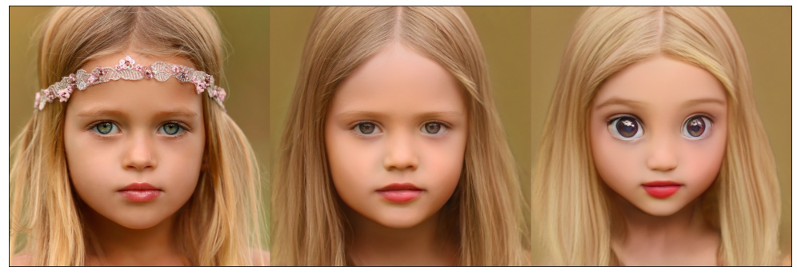
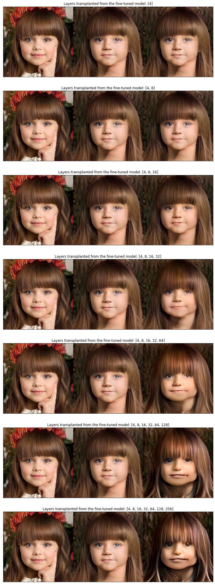

# Alienify/Zombify Yourself!

This code builds on [StyleGAN2-ADA](https://github.com/NVlabs/stylegan2-ada-pytorch) and Justin Pinkney's idea of blending the orininal StyleGAN2 and and the same network but fine-tuned on another dataset (e.g. aliens and zombies). You can train the network on your own dataset.

## Quick start
For quick start, run the [Colab notebook](https://colab.research.google.com/drive/1o6gsTHuA3G-FHohRN0lFquZX76eYRn50#scrollTo=mzog4xryYODB) hassle-free. If you have serious GPU compute, use it. Clone this notebook, make sure you have the right version dependencies, download the data (see the top of the Colab notebook).

### Projections

You can project a real target image (left) to the latent space and then back-project that latent represenation back to pixel space using different version of StyleGAN2, e.g. the orinal (middle) or fine-tuned on Pixar characters (right).

You can also fine-tune StyleGAN2 on a dataset of aliens and zombies, transplant some of its layers to the original StyleGAN2 trained on [FFHQ](https://github.com/NVlabs/ffhq-dataset) and get some creepy pictures!

### Latent space interpolation

Watch on YouTube:

[

](https://www.youtube.com/embed/V1-cEnOjnnI)

